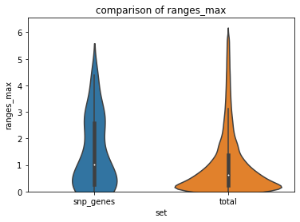

# Dissecting the role of gene expression variability in complex traits
by **Mikhail Slizen**  
supervisor: Yury Barbitoff  
***
Genome-Wide Association Study (GWAS) is a technique used to look for genome sequence variations that affect the development of complex traits. 

In recent years, GWAS results have been published for thousands of different traits, including two of the world's largest datasets, UK Biobank and Finngen[5]. It is known that changes in gene expression levels are one of the main mechanisms that determine the small effects of genetic variants detected during GWAS. 

In this project, we test the hypothesis that not only the level of gene expression, but also the degree of expression variability, is associated with the influence of a gene on complex human traits.

***
## Reqierements and tools
***
In this project Python=3.8 was udes with tje following packages:
**Python=3.8 packages:**
- pandas==1.4.1
- numpy==1.18.5
- re==2.2.1
- seaborn==0.11.
- scipy==1.7.3
- matplotlib==3.5.2

**Jupyter:**
- jupyter core     : 4.6.3
- jupyter-notebook : 6.0.3
- qtconsole        : 4.7.3
- ipython          : 7.14.0
- ipykernel        : 5.2.1
- jupyter client   : 6.1.3
- jupyter lab      : 2.1.2
- nbconvert        : 5.6.1
- ipywidgets       : 7.5.1
- nbformat         : 5.0.6
- traitlets        : 4.3.3

**Tools:**
- Plink 1.9. - `conda install -c bioconda plink`
- bedtools v2.27.1 - `conda install -c bioconda bedtools`

If you don't have Conda, install it first.

**Other:**
- PC RAM >=8Gb - some Plink tasks are memory demanding.
- OS - Ubuntu 20.04

***
## GWAS data
***

### UKBB pulse rate GWAS
***

Due to good signal as a source for SNPs was chosen pulse rate GWAS of UKBB made by NeilLab[1]
Whole list of availible GWAS data you can find [here](https://docs.google.com/spreadsheets/d/1kvPoupSzsSFBNSztMzl04xMoSC3Kcx3CrjVf4yBmESU/edit#gid=227859291).

You need two files wich will be combined later

`wget https://broad-ukb-sumstats-us-east-1.s3.amazonaws.com/round2/additive-tsvs/4194_irnt.gwas.imputed_v3.both_sexes.tsv.bgz -O ./pulse_rate/4194_irnt.gwas.imputed_v3.both_sexes.tsv.gz`

`wget https://broad-ukb-sumstats-us-east-1.s3.amazonaws.com/round2/annotations/variants.tsv.bgz -O ./pulse_rate/variants.tsv.gz`

Unzip files:

`gunzip ./pulse_rate/*.gz`

Combine files:

`paste -d, ./pulse_rate/variants.tsv ./pulse_rate/4194_irnt.gwas.imputed_v3.both_sexes.tsv > ./pulse_rate/GWAS_summary_merged.tsv`

Resulting file can be used as association file for `PLINK`

***
### PLINK clumping
***
For filtration and reduction of number of SNPs we need to perform clumping, which essentially clusters a number of SNPs to the one with lowest p-value in certain area.

For clumping PLINK needs a fileset with information about samples and patients. Due to computational limitations HamPam2[2] was used.

You can download it here:

`wget https://zzz.bwh.harvard.edu/plink/dist/hapmap_r23a.zip`

This archive contains three plunk files - .bim, .fam and .bed(do not confuse with other bed formats). Due to some data misformating (e.g. split chromosomes) it will be requiered to reformat this file.

`plink  --bfile ./hapmap/hapmap_r23a --make-bed' --out ./hapmap/hapmap`

If ypu lack memory - add `--memory <number of Mb>` command.

With this data we can perform clumping:

`plink  --bfile ./hapmap/hapmap --clump ./pulse_rate/GWAS_summary_merged.tsv --clump-p1 0.00000001 --clump-kb 250 --clump-snp-field rsid --clump-field pval --allow-extra-chr --out SNP`

Used commands:
- `--bfile` - path with prefix of plink fileset
- `-clump` - clumping command with path to assiciation file
- `-clump-p1 0.00000001` - specification to filter SNPs wit p-value less then 10E-8 - only high quality signals
- `--clump-kb 250` - size of chunk for clumping - default value
- `--clump-snp-field rsid --clump-field pval` - specifies column names in association file wich store variant name and p-value - original table does not exactly meet Plink demands
- `--allow-extra-chr` - allows to pass strange naming of chromosomes in files - this file has such problrm
- `--out` specifies prefix for output

This command will create .clumped file containig Lead-SNPs.

***
### Closest to LeadSNPs genes with bedtools
***
To find genes closest to this SNPs we will use GRCh37 RefSeq Reference Genome Annotation gff3 file.

Yo can download it this way:

`wget https://ftp.ncbi.nlm.nih.gov/refseq/H_sapiens/annotation/GRCh37_latest/refseq_identifiers/GRCh37_latest_genomic.gff.gz`

Don't forget to unpack it.

To find closest genes we will use `bedtools closest`. In order to do that we will convert our LeadSNP and gff3 data to sorted .bed format. You can find needed scripts in gwas_gtex.ipynb notebook here or do it your way.

With two bed files you can execute

`bedtools closest -a SNPS.bed -b genes.bed > SNPS_closest_genes.bed`

This file contains 363 LeadSNPs, with duplications. We will need it in the future.

***
## GTEx
***
GTEx Analysis V8 release was used to obtain gene expression data. 54 gene TMPs per tissue files were used[4].

You can find scripts for processing GTEx TPMs per tissue in `gwas_gtex.ipynb` notebook.

For each gene in each tissue were calculated ranges of expression normalyzed by median expression. Then, were found inter-tissue mean and maximum ranges of variability expression.

From `SNPS_closest_genes.bed` file from previous step gene names were parsed, deduplicated and filtered for expression in GTEx data. Stats from whole GTEx stats were subseted for genes with close SNPs. Distribution of netrics for two sets were compared.

***
## Results
***
From 56200 genes and 17382 samples from GTEx v8 were selected 44025 genes with expression at least in one tissue. was processed and some metrics of variability were calculated. Yo can explore result in `tpm_tissue_stats.tsv` file.

329 Lead SNPs were identified - `SNP.clumped`

This resulted in 363 close genes. Multiple duplications due to the vicinity of multiple SNPs to the same gene. Look here - `SNPS_closest_genes.bed`

After deduplication and subsetting variability data for genes with expression in GTEx  87 genes were left.
See - in `gwas_gtex.ipynb`

Сomparison of metrics' distributions showed following:

pvalue=0.006907539978084667

 

pvalue=6.83051521303779e-05

pvalue=0.006365441230775008

pvalue=0.060688442698665315

Therefore, there is a good chance that genes sifnifacntly affected bt SNPs have wider average range of expression.

You can find,execute or modify code here - `gwas_gtex.ipynb`

***
## Conclusion
***
- Genes related to altered phenotypes tend to have wider expression range. Additional research needed.

- In future would be usefull to combine multiple LeadSNPs derived from multiple GWAS. Bigger sts can affect result

- Is needed to refine statistical approaches. More rational way to choose metrics and nirmalize variables is needed.

***

## References
***
1. http://www.nealelab.is/uk-biobank 
2. https://www.ncbi.nlm.nih.gov/variation/news/NCBI_retiring_HapMap/
3. https://www.cog-genomics.org/plink/
4. https://gtexportal.org/home/datasets
5. Uffelmann, E., Huang, Q.Q., Munung, N.S. et al. Genome-wide association studies. Nat Rev Methods Primers 1, 59 (2021). https://doi.org/10.1038/s43586-021-00056-9

